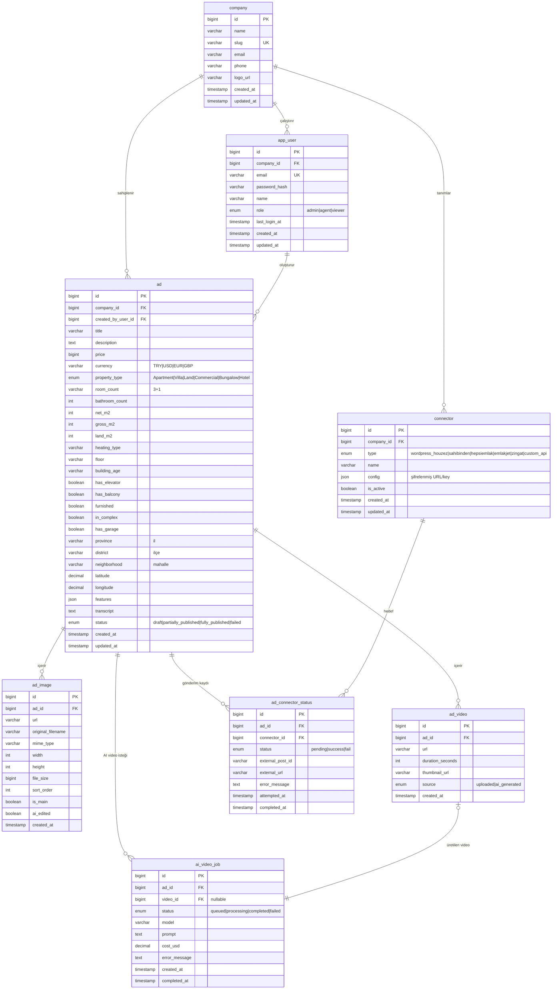

# Emlak Asistanı — DB ER Diyagramı (Mermaid)

WhatsApp'ta direkt görünmez ama **GitHub, Notion, Obsidian, VS Code preview** içinde otomatik render olur. Markdown destekli yere yapıştır.

> Daha şık görsel için: `schema.dbml`'i dbdiagram.io'da aç → PNG export et → o görseli paylaş.

## İlişki Açıklaması

- `company 1—N app_user` : Bir firmada birden çok kullanıcı
- `company 1—N connector` : Her firma kendi yayın hedeflerini tanımlar
- `company 1—N ad` : Firmaya ait ilanlar
- `app_user 1—N ad` : Bir kullanıcı birden çok ilan oluşturur
- `ad 1—N ad_image / ad_video` : İlana bağlı medya
- `ad 1—N ad_connector_status` : Her hedef için ayrı durum satırı
- `connector 1—N ad_connector_status` : Bir connectora birden çok ilan gönderilir
- `ad 1—N ai_video_job` : AI video oluşturma iş kuyruğu
- `ad_video 0/1—1 ai_video_job` : AI-üretilmiş video, kaynak job'a bağlı
